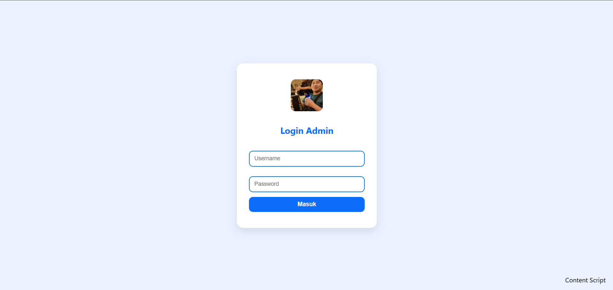
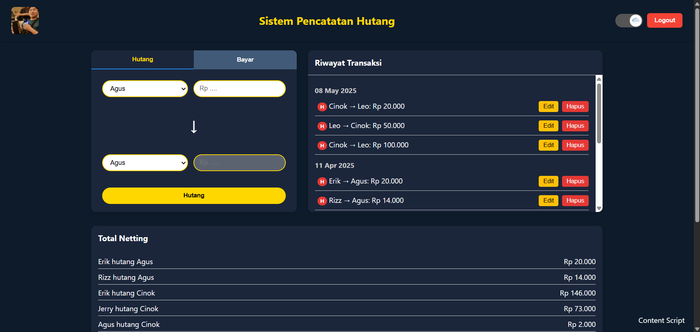
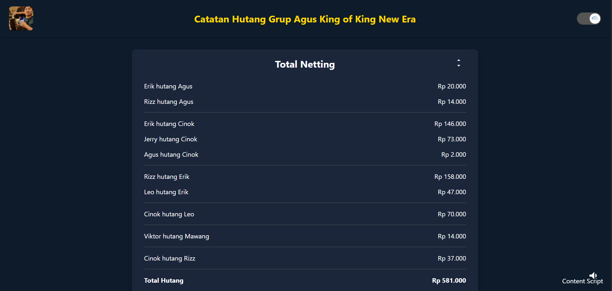

<h1 align="center">Hutang Grup System</h1>

###

System ini merupakan sistem untuk hutang grup yang dimana sistem ini memiliki netting dua arah yang bisa auto memotong hasil hutang yang ada. Sistem memiliki 2 mode yang light dan dark.

###

<h4 align="center">I code this with</h4>

###

  
  
  
  
  
  
  
  
  
  
  
  
  

###

<h4 align="left">Beberapa tampilan dari website ini</h4>

###

  

###

  

###

  

###